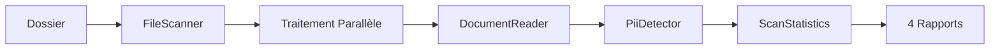

# 🔍 PII Scanner

Un scanner de données personnelles (PII) haute performance pour la conformité RGPD/DPA. Détecte automatiquement les informations sensibles dans vos fichiers (Word, Excel, PDF, texte) et génère des rapports détaillés.


## ✨ Fonctionnalités

### 🎯 Détection de PII

Détecte **11 types de données personnelles** avec validation avancée :

**Identité & Contact**
- ✉️ **Email** : Validation stricte du format
- 📞 **Téléphones France** : Tous formats (01-09, +33, avec séparateurs)
- 📞 **Téléphones Bénin** : Format +229 XX XX XX XX
- 📅 **Dates de naissance** : Format JJ/MM/AAAA (1900 - aujourd'hui)

**Identifiants Administratifs**
- 🆔 **Numéro de Sécurité Sociale** : 15 chiffres français
- 🏛️ **Numéro Fiscal FR** : 13 chiffres
- 🏛️ **IFU Bénin** : Identifiant Fiscal Unique

**Données Bancaires** (risque élevé)
- 💳 **Cartes bancaires** : Validation Luhn (16 chiffres)
- 🏦 **IBAN France** : 27 caractères
- 🏦 **IBAN Bénin** : Format BJ + 26 caractères

**Données Techniques**
- 🌐 **Adresses IP** : IPv4 valides (0-255 par octet)

### 📊 Rapports Multi-formats

Génère automatiquement **4 formats de rapports** :

| Format | Fichier | Usage |
|--------|---------|-------|
| 📄 **CSV** | `rapport_pii.csv` | Excel, traitement de données |
| 🔗 **JSON** | `rapport_pii.json` | Intégration API, automatisation |
| 🌐 **HTML** | `rapport_pii.html` | Présentation visuelle, management |
| 📊 **Excel** | `rapport_pii.xlsx` | Analyse de données (3 feuilles) |

### 🎨 Système de Scoring de Risque

Classification automatique des fichiers :

- 🔴 **ÉLEVÉ** : Données bancaires OU >10 PII
- 🟡 **MOYEN** : 3-10 PII
- 🟢 **FAIBLE** : 1-2 PII

### ⚡ Performance

- **Traitement parallèle** : Utilise tous les cœurs CPU
- **Barre de progression** : Feedback en temps réel
- **Gain de vitesse** : 2-4x plus rapide vs. traitement séquentiel
- **Thread-safe** : Collections concurrentes sécurisées

### 📁 Formats Supportés

- 📝 Texte : `.txt`, `.log`, `.csv`, `.json`
- 📄 Microsoft Word : `.docx`
- 📊 Microsoft Excel : `.xlsx`
- 📕 PDF : `.pdf`

## 🚀 Installation

### Prérequis

- [.NET 8.0 SDK](https://dotnet.microsoft.com/download/dotnet/8.0)
- Windows / Linux / macOS

### Compilation

```bash
# Cloner le projet
git clone <repository-url>
cd PiiScanner

# Compiler
dotnet build

# Compiler en Release (optimisé)
dotnet build -c Release
```

## 📖 Utilisation

### Lancement

```bash
dotnet run
```

### Exemple de session

```
=== PII SCANNER MVP ===
Chemin du dossier à scanner : C:\Users\samir\Documents

Scan en cours...

[██████████████████████████████████████████████████] 100% (150/150 fichiers)
✓ Scan terminé

=== STATISTIQUES DU SCAN ===
Fichiers scannés : 150
Fichiers contenant des PII : 45
Total de PII détectées : 234

Répartition par type :
  - Email: 85 (36.3%)
  - TelephoneFR: 52 (22.2%)
  - DateNaissance: 41 (17.5%)
  - IBAN_FR: 23 (9.8%)
  - CarteBancaire: 18 (7.7%)
  - NumeroSecu: 15 (6.4%)

Top 5 fichiers à risque :
  🔴 [ÉLEVÉ] client_data.pdf - 45 PII
  🔴 [ÉLEVÉ] factures.xlsx - 38 PII
  🟡 [MOYEN] contacts.txt - 7 PII
  🟢 [FAIBLE] notes.docx - 2 PII

Génération des rapports...
✓ CSV généré : rapport_pii.csv
✓ JSON généré : rapport_pii.json
✓ HTML généré : rapport_pii.html
✓ Excel généré : rapport_pii.xlsx

Scan terminé. 4 rapports générés avec succès !
```

## 📋 Rapports Générés

### 📄 CSV - `rapport_pii.csv`

```csv
# === RAPPORT DE SCAN PII ===
# Date: 2025-12-14 16:30:00
# Fichiers scannés: 150
# Fichiers avec PII: 45
# Total PII détectées: 234
#
# Répartition par type:
#   - Email: 85 (36.3%)
#   - TelephoneFR: 52 (22.2%)
#
# Top fichiers à risque:
#   [ÉLEVÉ] client_data.pdf - 45 PII
#
# === DÉTAILS DES DÉTECTIONS ===
Fichier;Type;Valeur
C:\path\file.pdf;Email;user@example.com
```

### 🔗 JSON - `rapport_pii.json`

```json
{
  "metadata": {
    "scanDate": "2025-12-14T16:30:00",
    "totalFilesScanned": 150,
    "filesWithPii": 45,
    "totalPiiFound": 234
  },
  "statistics": {
    "piiByType": [...],
    "topRiskyFiles": [...]
  },
  "detections": [...]
}
```

### 🌐 HTML - `rapport_pii.html`

Rapport visuel avec :
- 📊 Graphiques interactifs
- 🎨 Badges colorés par type de PII
- 📈 Statistiques en cartes
- 🔍 Tableau filtrable

### 📊 Excel - `rapport_pii.xlsx`

3 feuilles :
1. **Statistiques** : Vue d'ensemble
2. **Fichiers à risque** : Classement par risque
3. **Détections** : Toutes les PII détectées (avec filtres)

## 🔧 Configuration

### Ajouter un nouveau type de fichier

1. Modifier `FileScanner.cs` :
```csharp
private readonly string[] allowedExtensions = {
    ".txt", ".log", ".csv", ".json",
    ".docx", ".xlsx", ".pdf",
    ".xml"  // ← Nouveau format
};
```

2. Ajouter le traitement dans `DocumentReader.cs` :
```csharp
public static string ReadFile(string filePath)
{
    string extension = Path.GetExtension(filePath).ToLower();

    return extension switch
    {
        ".xml" => ReadXmlDocument(filePath),  // ← Nouvelle méthode
        ...
    };
}
```

### Ajouter un nouveau pattern de détection

Modifier `Analysis/PiiDetector.cs` :

```csharp
private static readonly Dictionary<string, string> Patterns = new()
{
    { "Email", @"\b[a-zA-Z][a-zA-Z0-9._%+-]*@[a-zA-Z0-9.-]+\.[a-zA-Z]{2,}\b" },
    { "NouveauType", @"regex_pattern_ici" },  // ← Nouveau pattern
    ...
};
```

## 🏗️ Architecture

```
PiiScanner/
├── Analysis/
│   └── PiiDetector.cs       # Détection PII avec regex + validation
├── Models/
│   ├── ScanResult.cs        # Résultat de détection
│   └── ScanStatistics.cs    # Calcul des statistiques
├── Reader/
│   └── DocumentReader.cs    # Extraction texte (Word, Excel, PDF)
├── Reporting/
│   ├── CsvReport.cs         # Génération CSV
│   ├── JsonReport.cs        # Génération JSON
│   ├── HtmlReport.cs        # Génération HTML
│   └── ExcelReport.cs       # Génération Excel
├── Scanner/
│   └── FileScanner.cs       # Scan parallèle des fichiers
└── Program.cs               # Point d'entrée + UI console
```

### Flux de traitement



## 🔬 Validations Avancées

### Algorithme de Luhn (Cartes bancaires)

Valide mathématiquement les numéros de carte :
```csharp
private static bool IsValidCreditCard(string cardNumber)
{
    // Validation Luhn - élimine 90% des faux positifs
    ...
}
```

### Validation des dates

- Dates entre 1900 et aujourd'hui
- Format JJ/MM/AAAA strict
- Pas de dates futures

### Validation des emails

- Doit commencer par une lettre
- Filtre les emails malformés
- Détecte les erreurs d'extraction

## 📊 Performance

### Benchmarks (CPU 4 cœurs)

| Fichiers | Séquentiel | Parallèle | Gain |
|----------|-----------|-----------|------|
| 50       | ~5s       | ~2s       | 2.5x |
| 200      | ~25s      | ~8s       | 3x   |
| 1000     | ~2min     | ~35s      | 3.4x |

### Optimisations

- ✅ `Parallel.ForEach` pour traitement multi-thread
- ✅ `ConcurrentBag<T>` pour collections thread-safe
- ✅ `MaxDegreeOfParallelism` = nombre de cœurs CPU
- ✅ `Interlocked.Increment` pour compteurs atomiques

## 🛡️ Sécurité

- ✅ Aucune donnée envoyée sur internet
- ✅ Traitement 100% local
- ✅ Pas de logs sensibles
- ✅ Rapports stockés localement uniquement

## 🌍 Langues

- Interface : **Français**
- Rapports : **Français**
- Code/Documentation : **Français + Anglais**

## 📄 Licence

Ce projet est sous licence MIT. Voir le fichier `LICENSE` pour plus de détails.

## 🤝 Contribution

Les contributions sont les bienvenues ! N'hésitez pas à :
1. Fork le projet
2. Créer une branche (`git checkout -b feature/AmazingFeature`)
3. Commit vos changements (`git commit -m 'Add AmazingFeature'`)
4. Push vers la branche (`git push origin feature/AmazingFeature`)
5. Ouvrir une Pull Request

## 📞 Support

Pour toute question ou problème :
- Ouvrir une [issue](https://github.com/user/repo/issues)
- Documentation complète : `CLAUDE.md`

## 🎯 Cas d'usage

- ✅ **Audit RGPD** : Identifier les PII avant mise en conformité
- ✅ **Migration de données** : Vérifier les données sensibles
- ✅ **Sécurité** : Détecter les fuites de données
- ✅ **Archivage** : Classifier les documents sensibles
- ✅ **Conformité DPA** : Rapports pour autorités

## 🔄 Roadmap

- [ ] Support fichiers images (OCR)
- [ ] Support base de données (SQL)
- [ ] API REST
- [ ] Interface graphique (GUI)
- [ ] Anonymisation automatique
- [ ] Détection ML/IA

---

**Fait avec ❤️ pour la conformité RGPD**

🔒 **Respectez la vie privée - Protégez les données personnelles**
